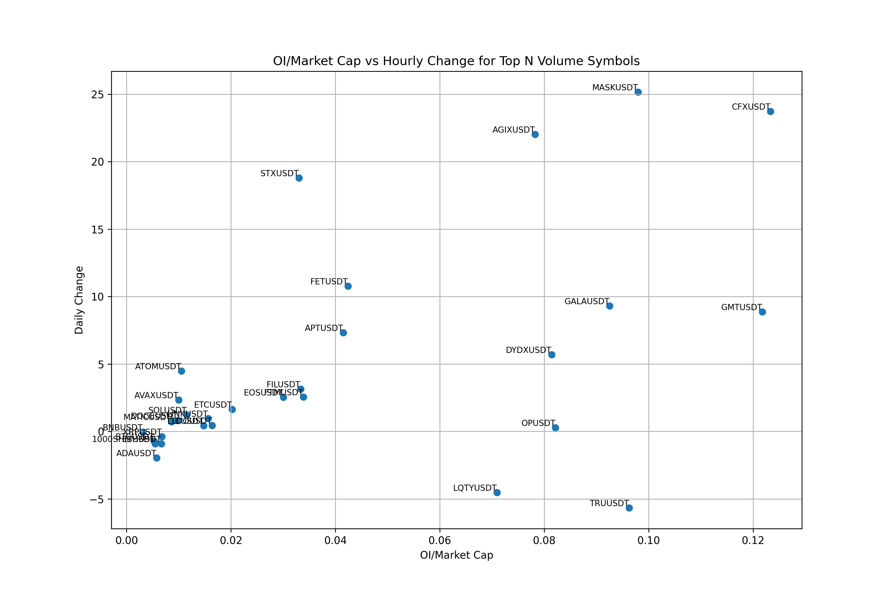

# Binance Futures OI Normalized by Market Cap

This script analyzes Binance Futures open interest data, normalizes it by market cap, and generates a scatter plot for visualization.

## Features

- Fetches open interest data from Binance Futures API
- Retrieves market cap data from CoinGecko API
- Calculates OI/Market Cap ratio
- Generates a scatter plot

A scatter plot will be displayed and saved as `scatter_plot.png`.

  

